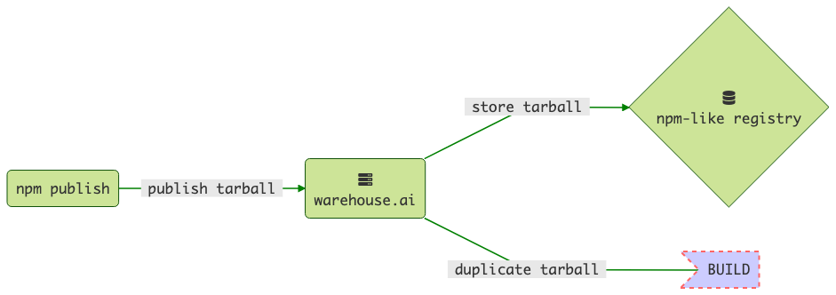
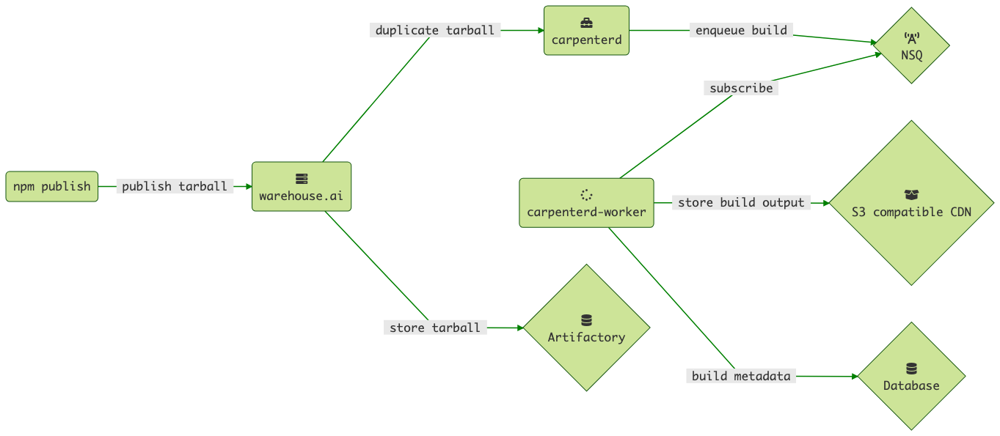
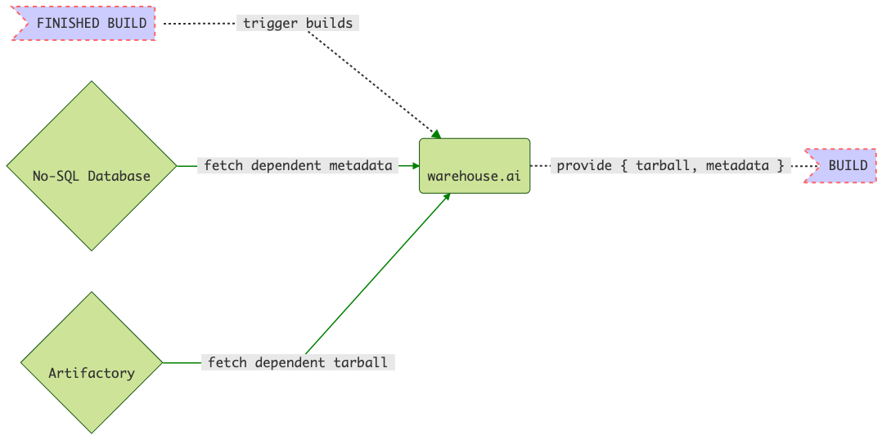
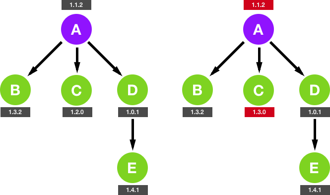
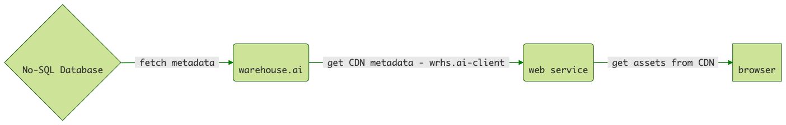
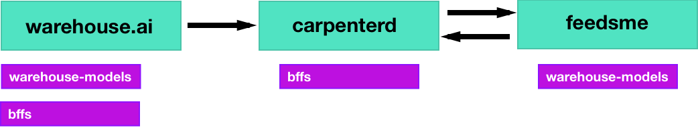

# `warehouse.ai`

[](https://www.npmjs.com/package/warehouse.ai)
[](https://github.com/godaddy/warehouse.ai/blob/master/LICENSE)
[](https://npmcharts.com/compare/warehouse.ai?minimal=true)
[](https://travis-ci.org/godaddy/warehouse.ai)
[](https://github.com/godaddy/warehouse.ai/blob/master/package.json)

A storage and developer workflow engine for npm packages.

## Install

```
git clone git@github.com:godaddy/warehouse.ai.git
cd warehouse.ai && npm install
```

## Usage

The module provides a [`bin/server`](./bin/server) script that starts the
service. The service requires [`carpenterd`][carpenterd] to run
locally or at the configured location as builds will run in `carpenterd`.
`warehouse.ai` can be started using:

```bash
npm start
```

## Motivation

The goal of the Warehouse is to support modular UI development by:

- Serving [fully built assets](#builds) (e.g. JavaScript, CSS, etc) for
  published modules through [a CDN target](#cdn-support).
- Decoupling [upgrade and rollback](#upgrade-and-rollback) of individual
  dependencies across multiple environments through use of `npm dist-tag`.
- Automatically [updating built assets](#auto-update-of-builds) when new
  versions of dependent modules are published.

In other words Warehouse.ai is designed to give as many programmatic
guarantees that it is safe to "always be on latest" and make rolling back as
painless as possible when issues arise.

- [Developer Experience](#developer-experience)
  - [Releasing code](#releasing-code)
  - [Rolling back to previous versions](#rolling-back-to-previous-versions)
  - [Auto-update of builds](#auto-update-of-builds)
- [API Documentation](#api-documentation)
  - [`npm` wire protocol](#npm-wire-protocol)
  - [Assets & Builds](#assets--builds-api)
- [Warehouse.ai Internals](#warehouseai-internals)
  - [Data Models](#data-models)
  - [Config options](#config-options)
- [Getting a package `warehouse.ai`-ready](#getting-a-package-warehouseai---ready)
- [Local development environment](#local-development-environment)
  - [Running tests](#running-tests)

## Developer Experience

The Warehouse was created with specific conventions around how developers
release code:

1. Front-end code is built to be modular by design.
2. A module must be up-to-date with the latest version of its dependencies.
3. Each module is released using `npm publish`
4. Each module is released **to production** using `npm dist-tag`

### Releasing code

> Stability: 2 – **Stable**

The release process for any module using the Warehouse is:

1. Add the following `publishConfig` to your `package.json`
```js
"publishConfig": {
  "registry": "https://where.you.are.running.your-warehouse.ai"
}
```
2. Publish the `module@version` which _releases it to your DEV_ environment.
```
cd /path/to/my/front-end/module
npm publish
```


3. Perform any manual QA in your DEV environment.
4. Promote the `module@version` to production using `npm dist-tag add`
```
npm dist-tag add module@version prod
```


Warehouse.ai builds are an interaction between multiple smaller microservices
to guarantee high concurrency and stability.



**NOTE** In order to publish to warehouse you must add the following to your
`.npmrc`. Authorization information is stubbed to let the `npm` client itself
actually make the publish request and not just throw an error before it even
tries.

```ini
//where.you.are.running.your-warehouse.ai/:_password=whocares
//where.you.are.running.your-warehouse.ai/:username=whocares
//where.you.are.running.your-warehouse.ai/:email=whocares@gmail.com
//where.you.are.running.your-warehouse.ai/:always-auth=false
```

> *NOTE:* You may also need to set `strict-ssl` to false if you do not
configure SSL termination for `where.you.are.running.your-warehouse.ai`

```
npm c set strict-ssl false
```

### Automatically build dependents

> Stability: 2 – **Stable**

After a package build completes Warehouse.ai will query the database for any
dependant modules. Builds for dependents will automatically be queued. The
system will walk all the way up the dependency tree until it
reaches a "top-level" package.

**NOTE** Dependent builds are only performed if the dependent has opted for
building with Warehouse.ai.



### Rolling back to previous versions

> Stability: 2 – **Stable**

The act of rolling back to a previous version takes two forms in the Warehouse:

1. **Rolling back a top-level module:** if a module has no dependents (i.e.
nothing depends on a given module) then that module is considered "top-level".
In this case a rollback in a specific environment will use the previous build
of the version being rolled back to with no other side-effects.
2. **Rolling back a module depended on by other modules:** if a module has
dependents (i.e. other modules depend on a given module) then rolling back to
a previous version in a specific environment will roll back the top level
module and all dependent modules to the version they were on for the given
release-line.

Rollback is performed using `npm dist-tag`. For example if `my-module` has a
production version of 1.0.5:

```
npm view my-module dist-tags
{
  latest: '1.0.5',
  devtest: '1.0.5',
  production: '1.0.5'
}
```

And we wish to rollback production to `1.0.4` then:

```
npm dist-tag add my-module@1.0.4 prod
```

This will reuse the build of `my-module@1.0.4` if it existed in `PROD` or
trigger a new build. Dependent modules will also rollback to the version
that depend on `my-module@1.0.4`.

### Auto-update of builds

> Stability: 1 – **Unstable**

The first (and most important) point developers need to be aware of is that
new builds from the Warehouse are on the latest matching semver version of
private dependencies tagged with that particular environment. Older existing
builds will remain unaffected however.

In other words **the version specified in the package.json may not match the
version used in builds, by design.** For example if a module that has the
following dependencies:

``` js
{
  "dependencies": {
    "private-dep-1": "1.0.x",
    "private-dep-2": "1.2.x",
    "private-dep-3": "~1.7.5",
    "public-dep-1": "1.0.x",
    "public-dep-2": "1.2.x"
  }
}
```

And the latest versions tagged with "production" and "devtest" are,
respectively:

**production**
```
private-dep-1@1.3.3
private-dep-2@1.2.8
private-dep-3@2.9.8
```

Then the build the Warehouse returns for your module _will include those
dependencies._



## API documentation

The Warehouse implements four distinct APIs over HTTP:

- _`npm` wire protocol:_ This is the HTTP API that the `npm` CLI client speaks.
  This allows the Warehouse to be a publish and install target for the `npm`
  CLI client itself. The wire protocol is implemented in two ways:
  - **Overridden routes:** These are routes that the warehouse itself has
    reimplemented to ensure that builds are fresh and that modules are
    installed from the correct environment.
  - **`npm` proxying:** before any 404 is served the request is first proxied
    over HTTP(S) to the location specified via `npm.urls.read`.
- _Assets & Builds:_ Creating ad-hoc builds, fetching builds and assets
(based on fingerprint), and when necessary finding builds for a particular
version or environment or both.

- All routes are able to get some debugging information by using the
`?debug=*` query parameter. This will override the output of your request and
show all logged output for that request as JSON, response headers that were
intended to be sent back, and content that was sent back.

### `npm` wire protocol

The following routes from the `npm` wire protocol are implemented:

```scala
PUT    /:pkg                          # Publish a package
GET    /:pkg                          # Install a package
DELETE /:pkg/-rev/:rev                # Unpublish a package
GET    /-/package/:pkg/dist-tags/     # Get all dist-tags
PUT    /-/package/:pkg/dist-tags/     # Update a dist-tag
POST   /-/package/:pkg/dist-tags/     # Set all dist-tags
GET    /-/package/:pkg/dist-tags/:tag # Get a dist-tag
PUT    /-/package/:pkg/dist-tags/:tag # Update a dist-tag
POST   /-/package/:pkg/dist-tags/:tag # Set a dist-tag
```

The rest of the requests related to the `npm` wire protocol will be sent to
the npm `read` or `write` URL specified in the [configuration](#config-options)

### Assets & Builds API

```scala
GET  /builds/:pkg                     # Get build information
GET  /builds/:pkg/:env/:version       # Get build information
GET  /builds/:pkg/:env/:version/meta  # Get build information
POST /builds/:pkg                     # Ad-hoc build
POST /builds/compose                  # Trigger multiple builds
```

To use the fingerprinted assets from the CDN the build information can be
fetched through the above API endpoints or by using [the warehouse.ai-client][client].



### Packages API

```scala
GET  /packages/                       # Get information about all packages
GET  /packages/:pkg                   # Get information about a specific package
POST /packages/search                 # Search for packages (if redis is configured)
```

### Release Line API

```scala
GET /release-line/:pkg/:version?      # Get release line for specified package and version (or latest if not defined)
```

### Promote API

```scala
PATCH /promote/:pkg/:env/:version     # Promote a package@version to an environment
```

### Environment-specific installation

Warehouse allows for installation against a specific `dist-tag` via the
`REGISTRY-ENVIRONMENT` header. Although `npm` does not allow for headers to be
set directly, [carpenterd] sets these headers internally during it's install
process.

This is how multiple versions live and are built side-by-side in the same
registry namespace. Without this nuance, the `latest` npm `dist-tag` would be
installed by default everywhere, including [carpenterd].

Future extensions to this header-only API are planned:

```
GET /env/:pkg  # Install a package against a specified "environment" (i.e. `dist-tag`)
```

## Warehouse.ai Internals

The purpose of this section is to document important internals, conventions
and patterns used by the Warehouse.



### Data Models

Currently the data models defined by the Warehouse are:

- Build
- BuildFile
- BuildHead
- Dependent
- Version
- Package

They are [documented individually in warehouse-models][models].

### Config options

``` js
{
  npm: {
    urls: {
      "auth-argument-factory": "/path/to/custom-auth.js",
      read: 'http://your.target-registry.com',
      write: 'http://your.target-registry.com'
    },
    cluster: {
      //
      // Gjallarhorn related options
      //
      gid: 0
      uid: 0
    },
    //
    // NpmVerifyStream related options
    //
    concurrency: 5,
    cleanup: true,
    read: { log: /* a debug logger */ }
  }
}
```

#### npm.auth-argument-factory

Warehouse has the ability to use [passport-npm] to check authorization when
connecting via `npm`. An example of this can be found in the
[tests for npm auth][auth].

## Getting a package `warehouse.ai` - ready

Let's take a client-side package and augment it so that it can be properly consumed in `warehouse.ai`. In this case, we will be

- Building with `webpack`
- Localizing for 2 different locales `en-US`, and `es-MX`.
- Defaulting to minified files in test and production

First, add these parameters in your `package.json`:

```json
{
  "scripts": {
    "build": "webpack"
  },
  "build": "webpack",
  "locales": [
    "en-US",
    "es-MX"
  ],
  "publishConfig": {
    "registry": "https://wherever-you-deployed-warehouse.ai"
  }
}
```

This indicates to `warehouse.ai` that you're building with `webpack` for the appropriate locales. Currently, 3 build systems are supported, `webpack`, `es*`, and `browserify`. These additional systems are further detailed [here](https://github.com/godaddy/carpenterd#identification-of-build-system-type).

Next, add a `wrhs.toml` at the top-level directory, with following contents, indicating which assets are to be served by default in each environment:

```toml
[files]
dev = ['dist/css/compiled-code.css', 'dist/js/compiled-code.js']
test = ['dist/css/compiled-code.min.css', 'dist/js/compiled-code.min.js']
prod = ['dist/css/compiled-code.min.css', 'dist/js/compiled-code.min.js']
```

You see the full enumeration of options available [here](https://github.com/warehouseai/extract-config#wrhstoml).

That's literally it. You can now follow the guide for [releasing code](#releasing-code).

## Tests

Running the tests will require a running cassandra instance on your local
machine. All tests are written with `mocha` and `istanbul`. They can be run
with `npm`:

``` bash
npm test
```

[carpenterd]: https://github.com/godaddy/carpenterd
[carpenterd-identify]: https://github.com/godaddy/carpenterd#identification-of-build-system-type
[client]: https://github.com/warehouseai/warehouse.ai-api-client
[models]: https://github.com/warehouseai/warehouse-models#readme
[passport-npm]: https://github.com/godaddy/passport-npm
[auth]: https://github.com/godaddy/warehouse.ai/blob/master/test/integration/npm/econn.test.js
